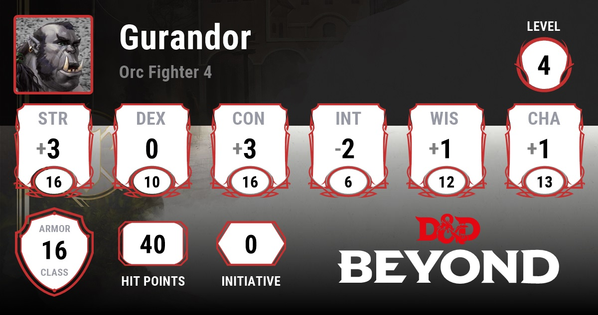
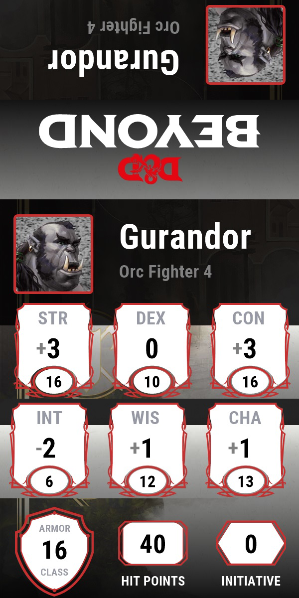

# dndb.Cards
Load dndb character cards and create a printable form for the dm screen

# framework: 
to build you will need to install current version of the .net core sdk (3.1)

# Usage: 
call from the console: "dndb.Cards.exe http://sharable-link" 

Example: dndb.Cards.exe https://ddb.ac/characters/7577901/EwYJYR

# images:
The open graph image is loaded from DNDBEYOND:

With simple transformation it becomes better fitted to a size of the initiative card:

# disclaimer:
all trademarks and images are belonging to dndbeyond (https://dndbeyond.com check them out, they are great) and should only be used in educational purposes. As soon as a public api will be available this repo will become obsolete and possibly reworked. Thank you 
